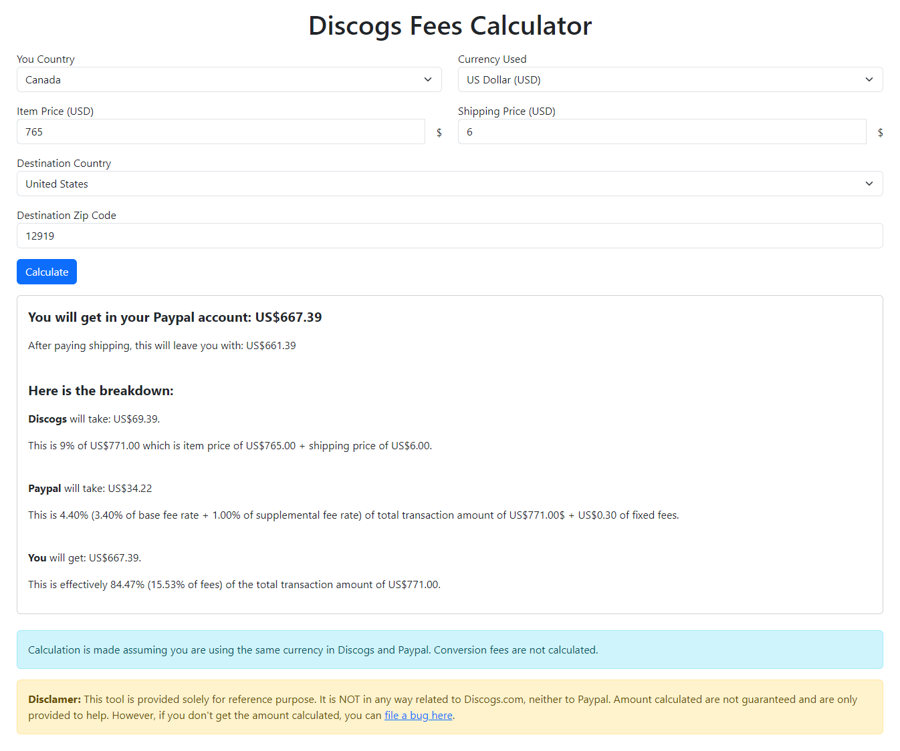

# Discogs Fees Calculator

A simple tool to help see the real amount you will get when you sell an item to a specific destination.

To see a working example or if you simply want to use the tool, please visit [my website](https://jaypare.com/tools).

<p align="center">
  
</p>

## Usage

This tool can be used as a website of it's own, on in any webpage.

To use it in another website:

1. Clone this repo in your website, either using submodule or git clone.

2. Add the following dependencies in your website, with at least the specified version:

   - [Bootstrap@5.3.0-alpha3](https://github.com/twbs/bootstrap)
   - [jquery@3.6.4](https://github.com/jquery/jquery)
   - [country-to-currency@1.0.9](https://github.com/thiagodp/country-to-currency)
     <br /><br />

   Example:

   ```html
   <head>
     <!-- Needed for Discogs Fees Calculator -->
     <link
       href="https://cdn.jsdelivr.net/npm/bootstrap@5.3.0-alpha3/dist/css/bootstrap.min.css"
       rel="stylesheet"
       integrity="sha384-KK94CHFLLe+nY2dmCWGMq91rCGa5gtU4mk92HdvYe+M/SXH301p5ILy+dN9+nJOZ"
       crossorigin="anonymous"
     />
     <script
       src="https://code.jquery.com/jquery-3.6.4.min.js"
       integrity="sha256-oP6HI9z1XaZNBrJURtCoUT5SUnxFr8s3BzRl+cbzUq8="
       crossorigin="anonymous"
     ></script>

     <script src="https://unpkg.com/country-to-currency@1.0.9/index.umd.js"></script>
     <!-- End Discogs Fees Calculator -->
   </head>
   ```

3. Add `discogsFeesCalculator.js` in your head:

   Example:

   ```html
   <head>
     <!-- Needed for Discogs Fees Calculator -->
     <script
       type="text/javascript"
       src="discogsFeesCalculator/discogsFeesCalculator.js"
     ></script>
     <!-- End Discogs Fees Calculator -->
   </head>
   ```

4. Add a div with `discogsFeesCalculator` attribute where you want the tool to appear. Attribute value must be the path to `index.html` from Discogs Fees Calculator.

   Example:

   ```html
   <article>
     <div discogsFeesCalculator="discogsFeesCalculator/index.html"></div>
   </article>
   ```

5. Add a `<script>` element at the end of your webpage, outsite the `<html>` element.

   Example:

   ```html
   <script>
     includeDiscogsFeesCalculator();
   </script>
   ```

## Future improvment

- Add a checkbox so user can indicate the shipping price he entered is the actual shipping cost of the shipping price he is using on the listing.
- Add a field for Paypal currency and calculate exchange fees.
- Add Paypal merchant fee rates for countries where it applies.
- Add a tab with reverse calculator, i.e.:
  - You input the price you want to get and the actual shipping cost you pay
  - You get the item price and shipping price you should sell the item to get this amount after paying Discogs fees, Paypal fees and shipping cost
- Add a tab for shipping calculator, i.e.:
  - You input your shipping cost
  - You get the shipping price you should set on your listing to get the shipping cost you entered after Paypal and Discogs fees

## Bug or feature request

To report an issue, or create a feature request, please visit [Issues](https://github.com/jayPare/discogsFeesCalculator/issues/new/choose).

## Disclamer

This tool is provided solely for reference purpose. It is NOT in any way related to Discogs.com, neither to Paypal. Amount calculated are not guaranteed and are only provided to help.
